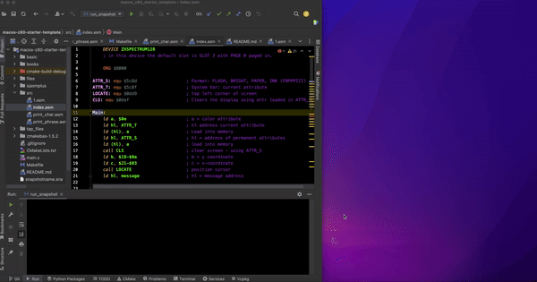

# Z80 MacOS Starter Template
ZX80 NEXT development tools for MacOS



### Requirements
1. Download [Z88DK](https://github.com/z88dk/z88dk/releases)
2. Download [Zesarux](https://github.com/chernandezba/zesarux/releases/tag/ZEsarUX-X)
3. Download [sjasmplus](https://github.com/z00m128/sjasmplus/blob/master/INSTALL.md#default-method-for-gnulinux--unix--macos--bsd)

### Using C Language
Place code in the `main.c` file & use the following command to compile
```
make build
```

### Using Z80 Assembly
Place your Assembly code in the `src` directory.
You can run each individual step to assemble with:
```
make clean
make assemble
make run_snapshot
```
Or use a single command to run all the above:
```
make run_assembly
```
This will assemble your code & open the Zesarux emulator &
run the compiled snapshot.

### Using NEXT Basic
Place your NEXT Basic code in the `basic` directory.
You can run each individual step to create a `.tap` file with:
```
make clean_tap
make bas_to_tap
make run_tap:
```
Or use a single command to run all the above:
```
make run_basic:
```
This will create a `.tap` file from your NEXT Basic code & open the Zesarux emulator.
Currently, it only loads the output `.tap` file, You will have to load the file manually
within the Zesarux emulator. 